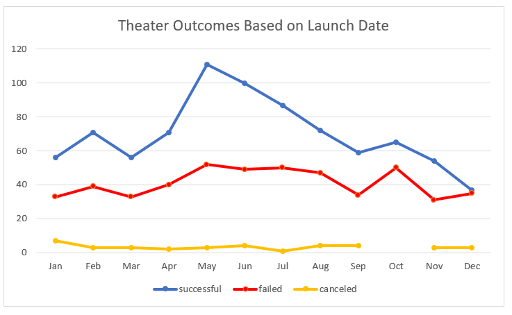

# Kickstarting with Excel

## Overview of the Analysis
### Louise is looking to start a Kickstart Funding Campaign to raise $12,000 for a Play that she will be producing.  This analysis gauges the level of success of Kickstart Funding Campaigns for Plays in the theater world based on timing and goals set by other producers of Plays.

## Purpose
### The purposes of this analysis is to assist Louise in understanding when she should start her campaign and whether or not her goal of $12,000 will be attainable.

## Analysis and Challenges
### The analysis for this project looked at various data points across several countries, campaign goals and months in which campaigns were launched.  We wanted to see if there were any predictors to the success of funding campaigns for Plays.
### There are some challenges with the data.
### 1. Many of the campaigns for Plays are $5,000 or less.  This skews the analysis so that it is difficult to predict whether or not she will be able to raise the $12,000 goal she has set for herself.  
### 2. The analysis looks at Plays from across the world and the level of success of a campaigns may vary depending on the country.  
### 3. The data also includes campaigns across several years.  As the popularity of these type of fundraisers grow, more recent years may be a better predictor of success.
### 4. This analysis does not take into consideration a comparison of goal and timing as contributing factors.  

## Analysis of Outcomes Based on Launch Date
### In reviewing funding for all plays agnostic of the goal, the data tells us that funding is more successful in the spring and more campaigns failed in the fall.  Assumptions that the spring is far enough away from the holiday season when donors would have more disposable income to give to the cause seems plausible.

 
## Analysis of Outcomes Based on Goals
### The below chart suggests that the lower the goal the higher the likelihood of success.  Looking at the $12,000 range has a 50% success rate.  The chart also suggests that campaigns between $35,000-$45,000 has a higher success rate, however, there are only nine campaigns at this level.  

 
## Challenges and Difficulties Encountered
### As previously stated, the average goal in the data set is much less than the goal that Louise has set for herself.  The Plays analyzed may not be representative of her locale and the timeframe may be impacting the results.
### The data set is a bit skewed because the average goal is in the $5,000 and not within the $12,000 that Louise has set for herself.  The reason the average goal is so low is that 83% of the campaigns are less than or equal to $5,000.  In reviewing campaigns between $10,000 and $15,000, the data would suggest a different timeframe for successful donations.  The chart below would suggest that the third quarter of the year would be a more successful time to start a funding campaign for two reasons:
### 1. There are the highest number of successful campaigns at 22.
### 2. The average goal is $11,000, which is in line with her goal.  

### In this lesson we learned:
•	Import data into a table for analysis.
•	Apply filters, conditional formatting, and formulas.
•	Generate and interpret pivot tables.
•	Calculate summary statistics such as measures of central tendency, standard deviation, and variance.
•	Characterize data to identify outliers in data sets.

### There is also a flaw in this data because the data set is small.  It might not be large enough to make an informed decision.  Additional analysis around removing the above-mentioned challenges might be worth the effort.  The issue here is that the data set, again, would be too small to be meaningful. 

## Results
### Based on the launch date only, we can assume that the spring is the best time to launch a funding campaign and launching a campaign in the 4th quarter of the year would not be successful.
### Based on the goal only, we can assume that the lower the goal the higher the success rate.  Goals between $10,000 an $15,000 have a success rate of 54%.
### The data set is limited in the fact that it may not be fully representative of what Louise is attempting to accomplish.  I am not sure that it fully answers the question. 
### It is recommended that additional data is collected to fully understand whether or not a goal of $12,000 would be successful.
